（注：本repo为2021秋季学期《数据库系统原理》课程作业。2022.04修订文档部分，内容摘自展示ppt）

## 一、项目简介

本项目为使用 Vue+Django 开发的综合教务管理系统，支持学生、教师、管理端多种身份。

* 学生端：支持学生选课、分为信息查询、事务申请、教学评价与个人中心等4个主要模块
* 教师端：同样支持对应的交互操作，如教表查询、申请代课、处理学生申请、学生成绩统计等功能
* 管理端：直接复用Django提供的Admin端，未进行二次开发

## 二、系统介绍

本节简单展示部分功能界面示例。

用户登录界面

学生端-选课界面

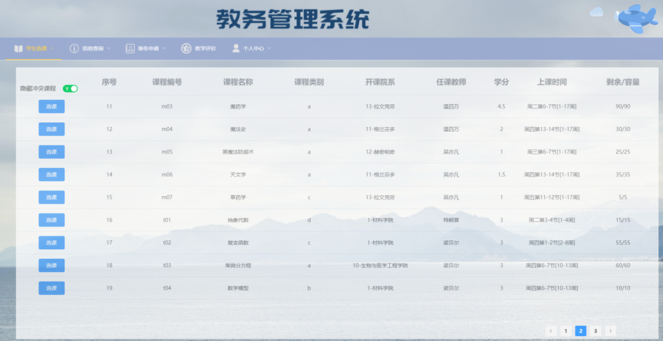

学生端-信息查询界面：包含如课表、考表信息

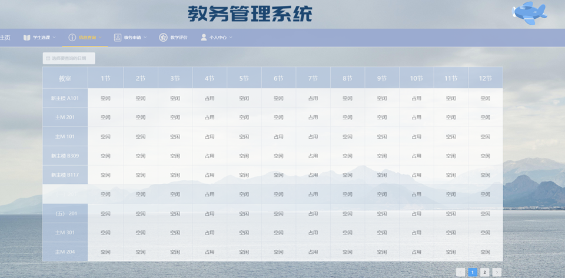

学生端-课程免听/免修申请

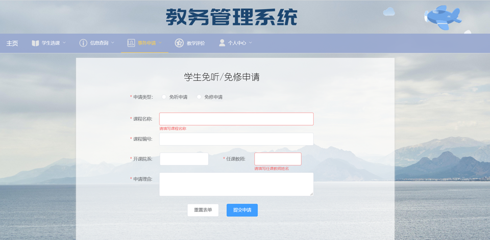

学生端-教师与课程评价

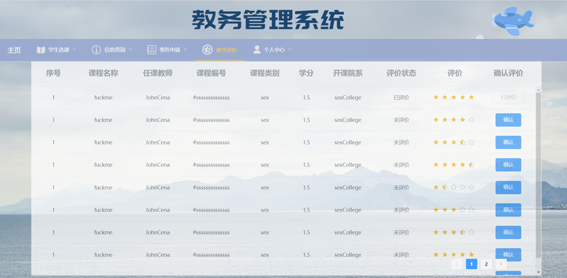

## 三、特色功能

### 1、用户分类

* 支持不同类型用户登录
* 分为学生、教师、管理员三种用户等级，及对应的联动操作。

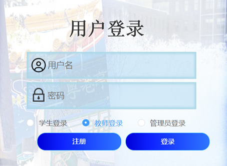

### 2、安全性检查

前后端均进行了详尽的错误类型检查，例如：

* 输入为空
* 不符合格式要求
* json格式错误
* 请求类型错误
* 账户不匹配等方案

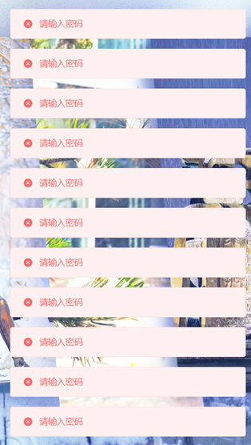

### 3、推荐课表

* 根据学生选课历史及成绩分析兴趣倾向，优先列出符合其兴趣的课程
* 在选课时优先推荐

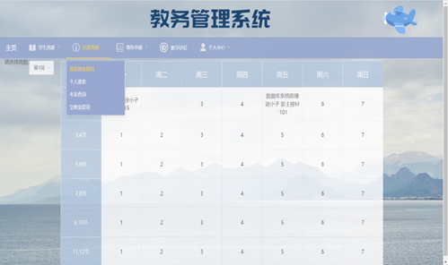

### 4、信息联动

* 学生端、教师端具有多种对应的联动操作
  * 开课 + 选课；
  * 课表 + 教表查询…
* 对同一事务操作赋予不同的权限等级
* 一致的风格界面

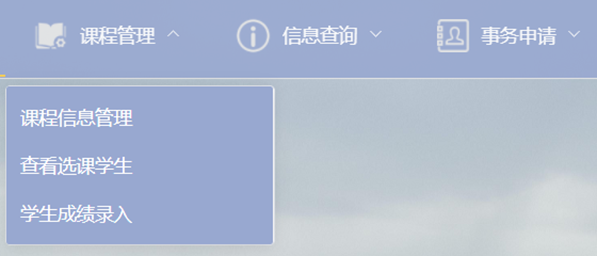

### 5、确认邮件

* 对密码修改等敏感操作，向用户注册时对应邮箱发送确认邮件

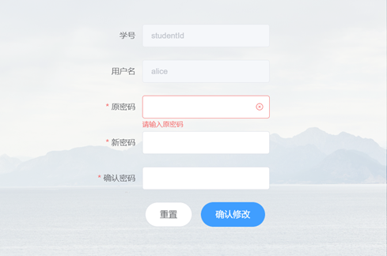

### 6、文件下载与上传

* 教师录入成绩时，支持excel模板的文件下载
* 同时接受上传的、符合要求的excel文件读取成绩信息

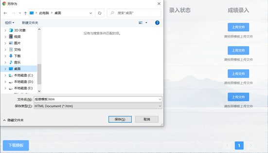

### 7、课程筛选

* 学生选课时，支持过滤时间冲突的课程
* 为学生定制推荐完美无冲突的课表

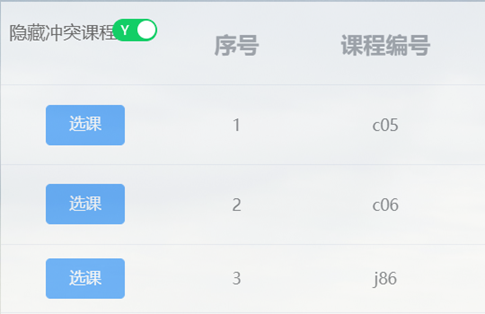

### 8、前后端通信

* 开发时前后端分离，利用通讯接口完成通信与数据交互（参见[接口文档](https://github.com/cpfy/EMS/blob/main/docs/%E4%BA%A4%E4%BA%92%E6%8E%A5%E5%8F%A3.md)）
* 利用axios工具以json格式进行数据传输
* 采用csrf与session认证保证安全性

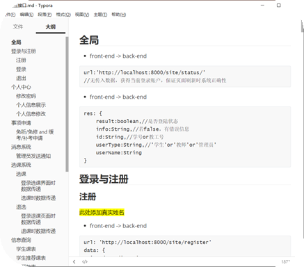

## 四、项目难点

### 1、敏捷开发

* 2个主要开发人员、1周不到的时间快速开发迭代出一个完善的版本。（人月神话？）

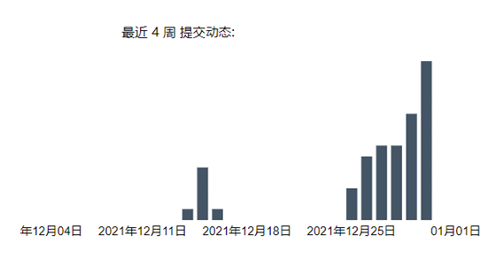

### 2、0基础

* 组员完全对web相关知识0基础
* 从最开始的python语言、框架选择，对照着教程与说明文档一点点拼凑起整座大厦

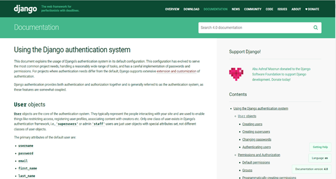

### 3、数据搜寻

* 开发过程中遇到大量困难与bug
* 查阅（极）大量资料
* 使用StackOverflow 、Google等社区平台，甚至阅读了部分源码完成bug修复

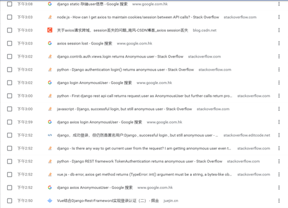

## 五、任务量展示

前端任务量（代码行数）：**4912**

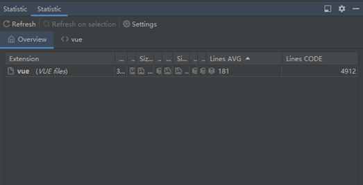

后端任务量（代码行数）：**2304**

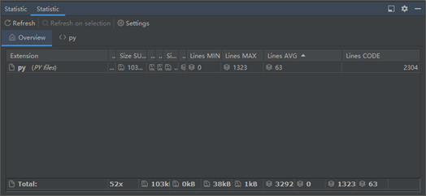
