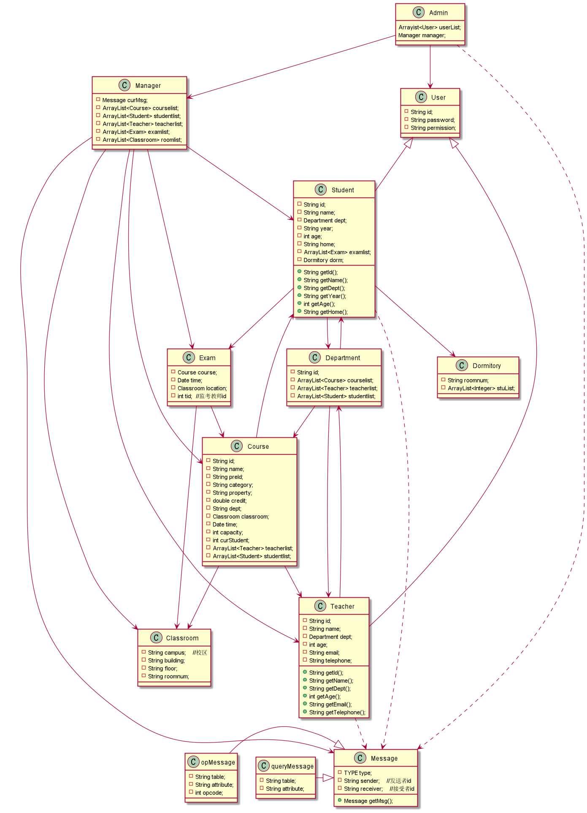
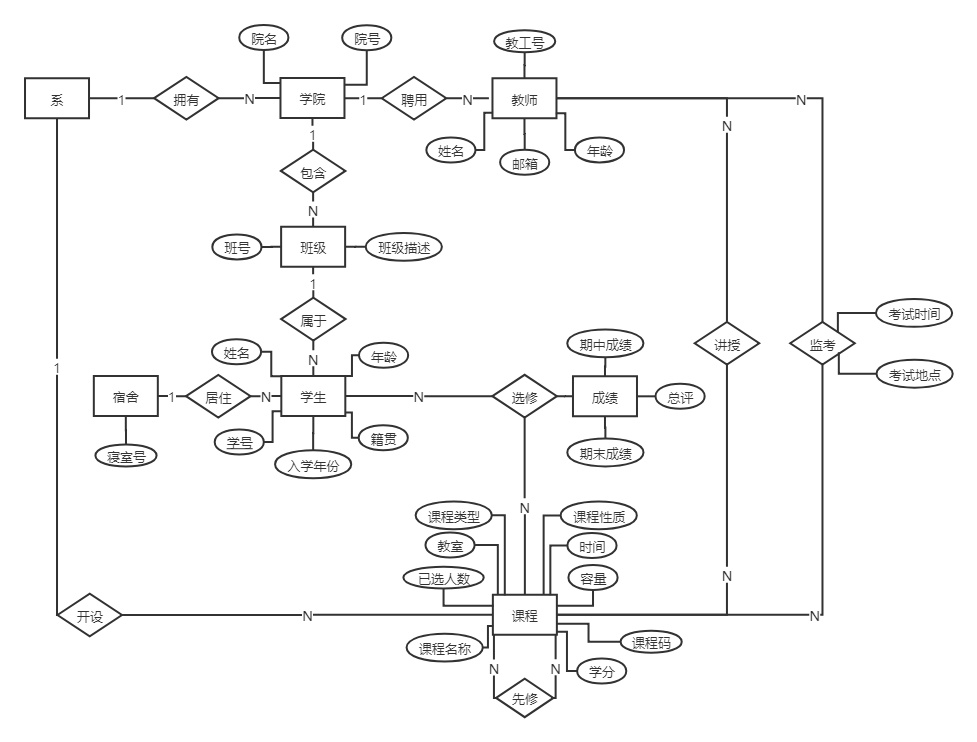
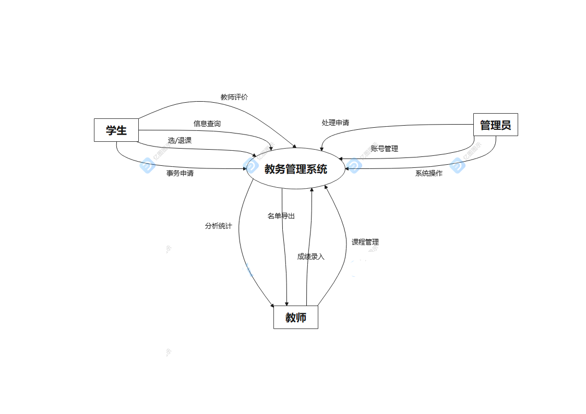

# 教务管理系统系统设计报告

## 1. 引言

### 1.1 编写目的

本文档编写目的是为教务管理系统项目开发提供系统设计规格说明, 主要有以下几条:

* 本文档描述对软件配置和运行环境等的规格说明及与开发人员了解的基础.
* 系统运行与测试环境的软硬件基本要求；
* 软件设计和架构布局, 作为开发与维护人员调试与检索的基础.
* 数据库中表的设计
* 用户需求调研

### 1.2 预期的读者和阅读建议

|编号|预期读者|阅读建议|
|:----:|:----:|:----:|
|1|客户|确认文档中软件具体设计的描述|
|2|开发方|理解并根据系统设计完成软件开发|

### 1.3 用户需求调研及功能设计

#### 学生

* 注册账号、登录账号、注销账号、修改密码等账号系统操作
* 查询指定学院所开课程信息（包括课程学分，开课老师等）
* 查询不同种类（专业课程、基础课程等）课程的课程信息
* 查询推荐课表
* 选课、退选课程
* 查询自己已选课程的课表
* 申请免修/免听课程
* 对任课教师以及课程进行评价
* 查询不同时间段空教室信息
* 申请缓考、补考

#### 教师

* 注册账号、登录账号、注销账号、修改密码等账号系统操作
* 开设课程
* 查询自己已开课程以及当前教学任务
* 查询已选自己开设课程学生
* 申请修改自己开设课程的信息（课程名称、教室、参考书）
* 申请开设期中期末考试
* 期中、期末以及总成绩录入及申请修改
* 申请其他老师临时代课
* 申请临时调整上课时间、地点
* 查询不同时间段空教室信息
* 回复学生缓考、补考申请，并做出拒绝或允许的操作，并给出理由反馈

#### 管理员

* 注册账号、登录账号、注销账号、修改密码等账号系统操作
* 管理学生和老师的账号
* 修改任意人员的的权限或数据
* 回复老师的申请，并做出拒绝或允许的操作，并给出理由反馈

## 2. 系统设计

### 2.1 系统框架配置

我们采取前后端分离式的开发结构，前端采用vue框架，后端采用django框架。

#### 前端

前端采用VUE框架，并借助vue的相关插件实现数据绑定，路由配置，项目编译打包等一系列工作的技术框架。并借助vue-cli，即vue脚手架实现初步的项目搭建。同时通过学习html，css，js等前端基础知识，完善整个项目。在脚手架中通过vue-router实现路由管理，通过vuex实现数据共享，通过axios实现项目的前后对接。同时vue框架具有简单易学，可构造解耦的可复用的组件来实现。

#### 后端

后端会采用Django框架进行开发，其是一个免费开源的Web框架，可以用于快速的搭建高性能的网站，并且Django提供了大量网站后台开发所需要的模块，使得开发者可以专注于业务部分，这说明了其高度的完整性。同时其也具有极好的扩展性，可以支持几乎所有主流的操作系统平台，如windows、linux、macos等。最后Django是由python语言开发了，python语言的流行性就注定了，Django的使用的广泛性，这也是我们选择其作为后端开发框架的主要原因。

### 2.2 系统运行环境

#### 硬件运行环境

	内存：2GB以上
	
	硬盘容量：40GB以上
	
	外设：鼠标、键盘
	
	网络设备：宽带或无线网络

#### 软件运行环境

	操作系统：Windows 7及以上，或其他支持使用wedkit内核浏览器的操作系统
	
	连接的后端数据库：Sql Server v18.10
	
	项目运行环境：Python 3.8
	
	浏览器：使用webkit内核的浏览器，如Edge，Chrome

#### 软件测试环境

	操作系统：Windows 10
	
	连接的后端数据库：Sql Server v18.10
	
	项目运行环境：Python 3.9

  浏览器：使用webkit内核的浏览器，如Edge，Chrome

#### 硬件测试环境

   	处理器：Intel(R) Core(TM) i5-9300H CPU @ 2.40GHz   2.40 GHz
   	
   	内存：16GB
   	
   	硬盘容量：1TB（952GB可用）
   	
   	输入输出设备：鼠标、键盘、显示屏
   	
   	网络设备：WIFI

## 3. 数据库表设计

### 学生表

| 字段名 | 字段类型 | 长度 | 主\外键 | 字段值约束 |
| :----- | :----- | :----- | :----- | :----- |
| 学号 | nvarchar | 15 | P | Not null |
| 姓名 | nvarchar | 5 |  | Not null |
| 院号 | int |  | F | Not null |
| 班号 | nvarchar | 5 | F | Not null |
| 入学年份 | nvarchar | 5 |  | Not null |
| 年龄 | int |  |  | Not null |
| 籍贯 | nvarchar | 15 |  | Not null |

原学生表是一个2NF，学号->系号，院号->系号，学号->系号 构成了非主属性对码的传递依赖。

规范操作为将系号从学生表中去掉，由院表储存相关信息。

### 教师表

| 字段名 | 字段类型 | 长度 | 主\外键 | 字段值约束 |
| :----- | :----- | :----- | :----- | :----- |
| 教工号 | nvarchar | 15 | P | Not null |
| 姓名 | nvarchar | 5 |  | Not null |
| 院号 | int |  | F | Not null |
| 年龄 | int |  |  | Not null |
| 邮箱 | nvarchar | 30 |  |  |
| 联系电话 | nvarchar | 11 |  |  |

教师表已经是3NF。

### 职工表

| 字段名 | 字段类型     | 长度  | 主\外键 | 字段值约束    |
|:----|:---------|:----|:-----|:---------|
| 教工号 | nvarchar | 15  | P    | Not null |
| 姓名  | nvarchar | 5   |      | Not null |

职工表已经是3NF。

### 系表

| 字段名 | 字段类型     | 长度  | 主\外键 | 字段值约束    |
|:----|:---------|:----|:-----|:---------|
| 系号  | int      |     | P    | Not null |
| 系名  | nvarchar | 10  |      | Not null |

系表已经是3NF。

### 学院表

| 字段名 | 字段类型 | 长度 | 主\外键 | 字段值约束 |
| :----- | :----- | :----- | :----- | :----- |
| 院号 | int |  | P | Not null |
| 系号 | int |  | F |  |
| 院名 | nvarchar | 10 |  | Not null |

学院表已经是3NF。

### 班级表

| 字段名 | 字段类型 | 长度 | 主\外键 | 字段值约束 |
| :----- | :----- | :----- | :----- | :----- |
| 班号 | nvarchar | 10 | P | Not null |
| 班级描述 | nvarchar | 10 |  |  |

班级表已经是3NF。

### 课程表

| 字段名 | 字段类型 | 长度 | 主\外键 | 字段值约束 |
| :----- | :----- | :----- | :----- | :----- |
| 课程码 | nvarchar | 15 | P | Not null |
| 课程名称 | nvarchar | 10 |  | Not null |
| 前置课程码 | nvarchar | 15 | F |  |
| 课程类别 | nvarchar | 10 |  | Not null |
| 课程性质 | nvarchar | 10 |  | Not null |
| 学分 | unmeric(3,1) |  |  | Not null |

课程表已经是3NF。

### 学生选课表SC

| 字段名 | 字段类型 | 长度 | 主\外键 | 字段值约束 |
| :----- | :----- | :----- | :----- | :----- |
| 学号 | nvarchar | 15 | P | Not null |
| 课程码 | nvarchar | 15 | P\F | Not null |

学生选课表已经是3NF。

### 课程选课表

| 字段名 | 字段类型 | 长度 | 主\外键 | 字段值约束 |
| :----- | :----- | :----- | :----- | :----- |
| 课程码 | nvarchar | 15 | P\F | Not null |
| 教室 | nvarchar | 10 |  | Not null |
| 时间 | nvarchar | 20 |  | Not null |
| 容量 | int | 10 |  | Not null |
| 已选人数 | int |  |  | Not null |

课程选课表已经是3NF。

### 教师授课表

| 字段名 | 字段类型 | 长度 | 主\外键 | 字段值约束 |
| :----- | :----- | :----- | :----- | :----- |
| 教工号 | nvarchar | 15 | P\F | Not null |
| 课程码 | nvarchar | 15 | F | Not null |

教师授课表已经是3NF。

### 考试表

| 字段名 | 字段类型 | 长度 | 主\外键 | 字段值约束 |
| :----- | :----- | :----- | :----- | :----- |
| 课程码 | nvarchar | 15 | P\F | Not null |
| 时间 | nvarchar | 20 |  | Not null |
| 教室 | nvarchar | 10 |  | Not null |
| 教工号(监考老师) | nvarchar | 15 | F | Not null |

考试表已经是3NF。

### 成绩表

| 字段名 | 字段类型 | 长度 | 主\外键 | 字段值约束 |
| :----- | :----- | :----- | :----- | :----- |
| 学号 | nvarchar | 15 | P\F | Not null |
| 课程码 | nvarchar | 15 | P\F | Not null |
| 期中成绩 | numeric(5,2) |  |  |  |
| 期末成绩 | numeric(5,2) |  |  | Not null |

成绩表已经是3NF。

### 宿舍表

| 字段名 | 字段类型 | 长度 | 主\外键 | 字段值约束 |
| :----- | :----- | :----- | :----- | :----- |
| 学号 | nvarchar | 15 | P\F | Not null |
| 姓名 | nvarchar | 5 |  | Not null |
| 寝室号 | nvarchar | 10 |  | Not null |

宿舍表已经是3NF。

### 用户表

| 字段名 | 字段类型 | 长度 | 主\外键 | 字段值约束 |
| :----- | :----- | :----- | :----- | :----- |
| 账号 | nvarchar | 20 | P | Not null |
| 密码 | nvarchar | 20 |  | Not null |
| 权限类型 | nvarchar | 10 |  | Not null |

用户表已经是3NF。

## 4. 类与架构设计

### 类图绘制

### 类图说明

* User是教务系统用户父类；
* Student是学生类，也作为用户的一个子类；
* Teacher是教师类，也作为用户的一个子类；
* Message是交互请求父类;
* queryMessage是请求子类, 表示查询类型的请求;
* opMessage是请求子类, 表示操作类型的请求;
* Account是用户账户父类;
* Classroom是教室类, 表示地点;
* Exam是考试类;
* Department是系类;
* Dormitory是宿舍类
* Manager为管理主类，具有容器操作、管理全部对象；

### er图绘制

### 数据流图绘制

